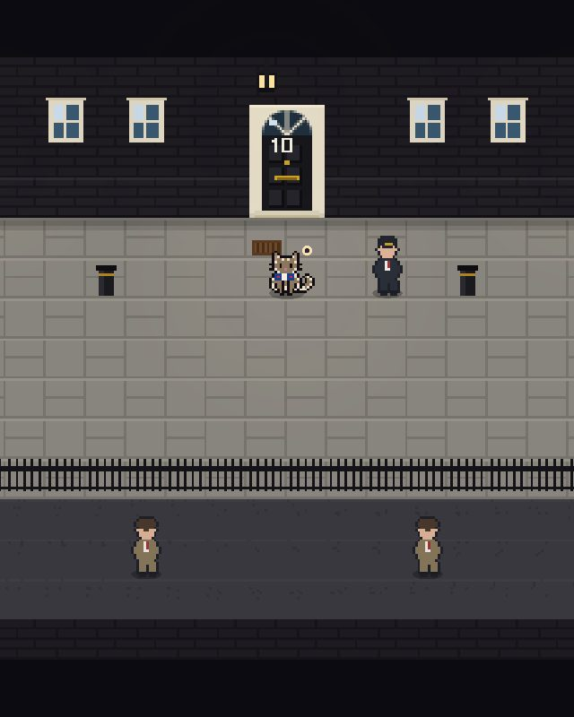
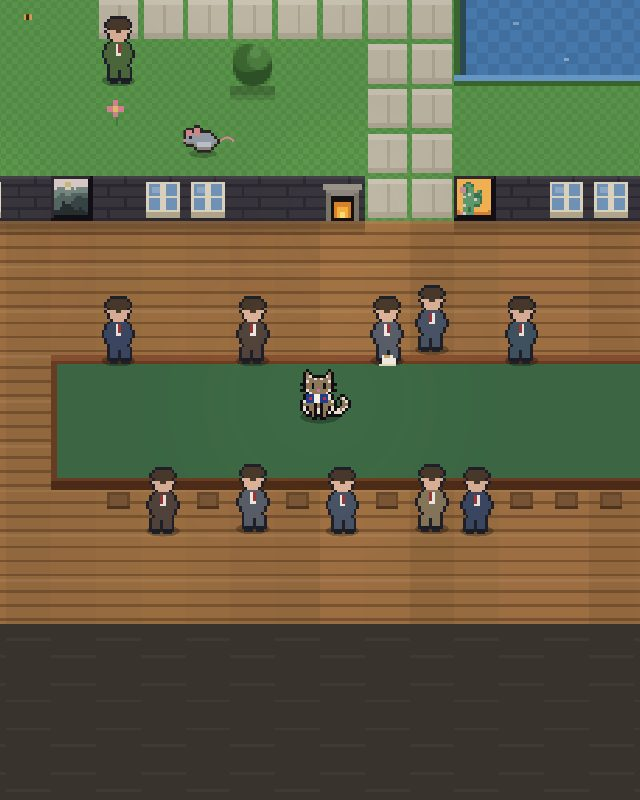
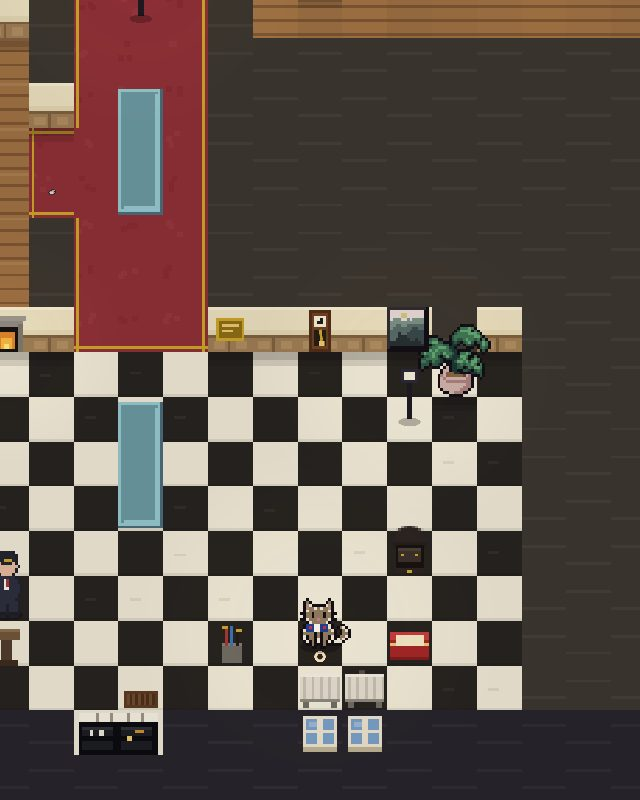
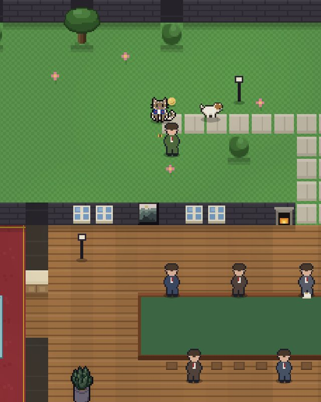

# LARRY — Chief Mouser to the Cabinet Office

**▶ Play it now: [melindajli.github.io/chief-mouser-game](https://melindajli.github.io/chief-mouser-game/)**

A cosy top-down pixel-art game about the real Larry: from a Battersea shelter
to No. 10 Downing Street, complete with his Union Jack bow tie. Prime Ministers
(numbered, anonymous, ever-changing) come and go — you remain: catching mice,
holding photo-op poses, attacking the post, and collecting increasingly silly
government honours.

| The famous door | The Cabinet, in session |
| --- | --- |
|  |  |

| The Entrance Hall | The garden (dog day) |
| --- | --- |
|  |  |

## The story

You start at Battersea, catching mice in Cattery 4 to impress a mysterious
visitor in a very serious grey suit. Papers are signed, a bow tie is issued,
and you are carried over the famous threshold into a doorstep press conference.

From there the story plays out in staged dialogue scenes over the living
world: the staff introduce themselves (and their side deals), a herald mouse
delivers King Rat's terms in person, every new Prime Minister is brought to
meet *you*, and the career crowns itself with a garden ceremony — Palmerston
of the Foreign Office in attendance, nodding once — before a homecoming visit
to the shelter where it all began.

## The house

Explorable and laid out after the real No. 10 — right down to details like
the front door having no outside handle:

- **Ground floor** — the Entrance Hall (chequerboard floor, Chippendale
  guard's chair, Larry's radiator), the Corridor, the Cabinet Room (boat
  table, Walpole over the fireplace), the Press Office, the PM's Study, and
  the Grand Staircase — yellow, with a portrait of every PM as they come and go
- **Basement** — the Kitchen, the Pantry, and the Cellar: prime mouse country,
  and the seat of a certain rival monarchy
- **First floor** — the White Drawing Room, Terracotta Room, Pillared Drawing
  Room, and the State and Small Dining Rooms — plus a green baize door at the
  end of the landing that officially does not exist
- **The private flat, above No. 11** — where Prime Ministers cook their own
  suppers and even Chief Mousers go off duty
- **The Garden** — half an acre, L-shaped, occasionally contested by the
  Foreign Office cat or (on the worst days) a dog

## Ten mini games, one per cat instinct

- **Post Watch** — the eleven o'clock delivery shoots through the letterbox;
  bat the letters out of the air, and mind the decoy rattles
- **Hold the Pose** — photo-ops are a composure meter: tap when the tail
  settles in the gold, three frames, faster each shot
- **Kitchen Suppers** — the PM cooks, scraps fall from the flat's supper
  table, and the floor is the enemy
- **The Midnight Zoomies** — ten paw-print gates around the whole ground
  floor at ludicrous speed; gold pace earns The 3 A.M. Protocol
- **The Pigeon AGM** — grandmother's footsteps at the pond: creep while
  they peck, FREEZE when they look
- **Whack-a-Mouse** — the basement holes are singing; answer every head
- **The Under-Road** — Act Two of the war: a smuggling tunnel below the
  Cellar, six lanes of rat patrol, one stolen larder (unlocked by deposing
  the Rat King)
- **The Red Dot Protocol** — MI-Paw's dream construct: 45 seconds, one
  dot, and only a landed pounce counts (unlocked by running the Under-Road)
- **The Gull Affair** — eight seagulls strafe the garden-party sandwiches;
  read the telegraph, lead the target, close the airspace
- **The Heights** — pounce ledge to ledge up the tallest bookcase in
  government; wobbly shelves tip, the air does not hold cats, and the
  highest perch in the house has never held one. Officially.

(There is also something behind the garden hedge. It is protected by
statute. No further questions.)

## Everything else

- A serialized Red Box campaign (the mice organise, then besiege) with the
  biggest escalations delivered by a breathless aide, in person
- **The Daily Sortie** — a seeded 120-second score attack, the same mice for
  everyone in the world that day, with a shareable result — plus a seeded
  *condition of the day* (Night Shift, Swift Day, Rush Hour)
- **The Morning Red Box & the Evening Paper** — three goals each real day;
  the paper prints at dusk with your numbers, a headline, and your streak
- 23 honours on a proper honours board, a List of Mischief, hidden secrets,
  dreams, gadgets from Bureaucratic Zoomies to the Ceremonial Cape, bow ties,
  seasonal weather, a generative chiptune score that rests between passes —
  and Nine Lives prestige when the Garter is won
- Donate kippers home to Battersea. Obviously.

## Play locally

It's a static site — no build step. Serve the folder and open it:

```bash
python3 -m http.server 8000
# open http://localhost:8000
```

Desktop: WASD/arrows to move, SPACE to pounce (hold to charge), E laser,
Q meow, M house map. Phones: tap to walk, drag to steer, buttons on screen.
Gamepad supported. Served over HTTP it's an installable PWA that works offline.

Dev/test URL params: `?autostart` (skip title), `&nocard` (skip intro card),
`&skipintro` (jump straight to No. 10), `&map=basement&x=4&y=13` (spawn point).

## Art credit

Cat sprites, room furniture and plants are from the free packs by
[toffeecraft](https://toffeecraft.itch.io/cat-pack), with the main cat
recoloured to match the real Larry's coat (and tuxedo/black variants for
the rival mousers). All other art — the house, the mice, the dog, the
letters — is drawn in code.
