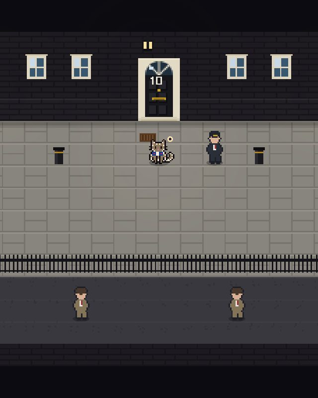
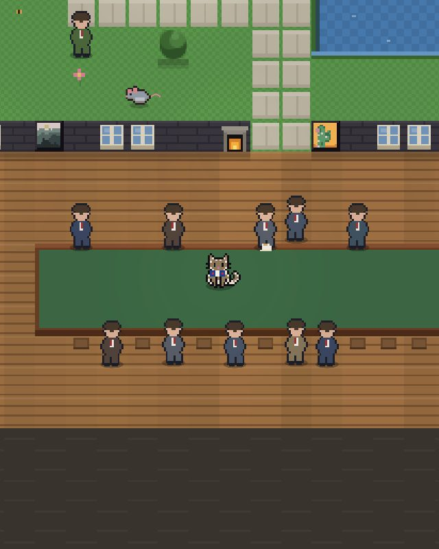
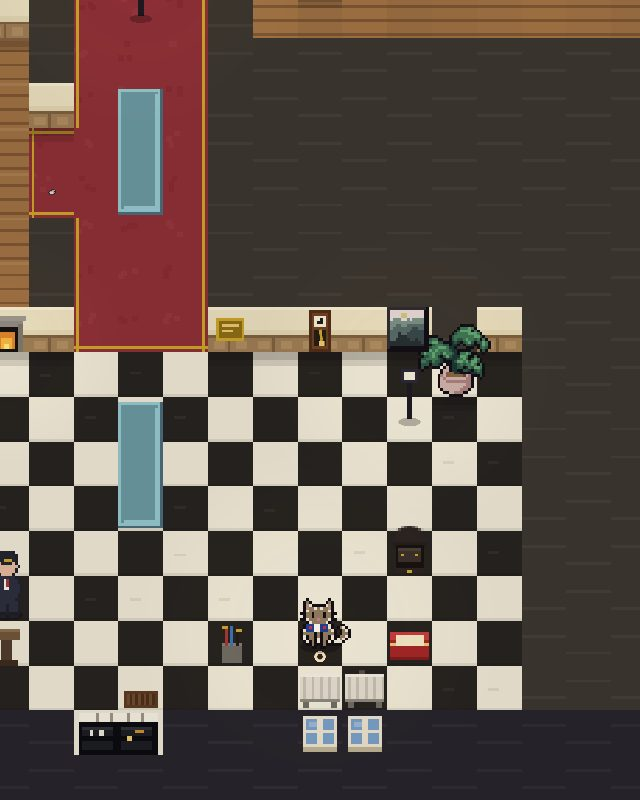
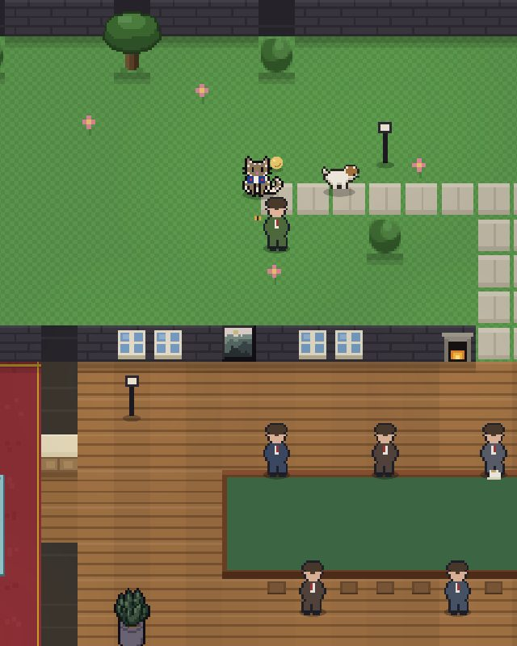

# LARRY — Chief Mouser to the Cabinet Office

**▶ Play it now: [melindajli.github.io/chief-mouser-game](https://melindajli.github.io/chief-mouser-game/)**

A cosy top-down pixel-art game about the real Larry: from a Battersea shelter
to No. 10 Downing Street, complete with his Union Jack bow tie. Prime Ministers
(numbered, anonymous, ever-changing) come and go — you remain: catching mice,
facing down the press pack, attacking the post, and collecting increasingly
silly government honours.

| The famous door | The Cabinet, in session |
| --- | --- |
|  |  |

| The Entrance Hall | The garden (dog day) |
| --- | --- |
|  |  |

## The story

You start at Battersea, catching mice in Cattery 4 to impress a mysterious
visitor in a very serious grey suit. Papers are signed, a bow tie is issued,
and you are carried over the famous threshold into a doorstep press conference.

From there the story plays out in staged dialogue scenes over the living
world: the staff introduce themselves (and their side deals), a herald mouse
delivers King Rat's terms in person, every new Prime Minister is brought to
meet *you*, and the career crowns itself with a garden ceremony — Palmerston
of the Foreign Office in attendance, nodding once — before a homecoming visit
to the shelter where it all began.

## The house

Explorable and laid out after the real No. 10 — right down to details like
the front door having no outside handle:

- **Ground floor** — the Entrance Hall (chequerboard floor, Chippendale
  guard's chair, Larry's radiator), the Corridor, the Cabinet Room (boat
  table, Walpole over the fireplace), the Press Office, the PM's Study, and
  the Grand Staircase — yellow, with a portrait of every PM as they come and go
- **Basement** — the Kitchen, the Pantry, and the Cellar: prime mouse country,
  and the seat of a certain rival monarchy
- **First floor** — the White Drawing Room, Terracotta Room, Pillared Drawing
  Room, and the State and Small Dining Rooms — plus a green baize door at the
  end of the landing that officially does not exist
- **The private flat, above No. 11** — where Prime Ministers cook their own
  suppers and even Chief Mousers go off duty
- **The Garden** — half an acre, L-shaped, occasionally contested by the
  Foreign Office cat or (on the worst days) a dog

## The shape of it

No. 10 is a **hub**: walkable, cosy, full of mice, and where the story happens.
Almost every game is a **room you enter** — the invitation card explains the
rules, the screen fades, and you arrive somewhere built for that one game and
nothing else. Ten of the twelve work that way. The exceptions are deliberate:
**The Midnight Zoomies** is a lap of the actual ground floor (it is the hub's
own game), and **the Doorstep Scrum** and **the Fox Incident** both happen out
front on Downing Street, which is already a small stage of its own.

## Twelve mini games — and the Brief asks for every one

- **The Doorstep Scrum** — the press pack fires at anything that moves and a
  cat caught mid-blink is tomorrow's unflattering front page. Stay out of
  their flashes; when the photographer who asks properly frames a shot, get
  in it and hold still
- **Kitchen Suppers** — the PM cooks, scraps fall from the flat's supper
  table, and the floor is the enemy
- **The Canapé Line** — a state reception is being plated along a trolley,
  and nobody is watching the trolley. TAKE the salmon, prawn and cheese;
  LEAVE the cucumber, onion and grapes (two of those are poison to a cat,
  and nobody needs a cucumber). A ring tells you what is in reach
- **The Midnight Zoomies** — ten paw-print gates around the whole ground
  floor at ludicrous speed; gold pace earns The 3 A.M. Protocol
- **The Pond** — ornamental fish, bought at public expense, in a pond you are
  technically responsible for. Its own pondside, with the whole bank on screen
  at once: you cannot swim and cannot reach across the water, so the job is
  being in the right place at the right moment. A ripple is a starting gun,
  not a cue to stand still. Leap with nothing up and you go in, and every fish
  stays down a while afterwards
- **The Fox Incident** — the real story: past midnight on the Street,
  something long, low, and amber. Advance while it paces; when it lunges,
  DO NOT MOVE. Hold three stands and it blinks first
- **The Catnip Dream** — a bed nobody admits to planting drops you somewhere
  else entirely. Larry sits down and does not move for the whole game; things
  that are not there drift in out of the dark toward a glowing ring, and the
  only verb is POUNCE and the only question is WHEN. Swipe at nothing and your
  paw is committed while the dream keeps coming. The one timing game in the house
- **The Under-Road** — Act Two of the war: a smuggling tunnel below the
  Cellar, six lanes of rat patrol, one stolen larder (unlocked by deposing
  the Rat King)
- **The Red Dot Protocol** — MI-Paw's dream construct: 45 seconds, one
  dot, and only a landed pounce counts (unlocked by running the Under-Road)
- **The Descent** — a behind-the-cat run down the Grand Staircase on your own
  cushion: steer, hop the ministers, the press pack, the fans and the hoover,
  collect kippers on the good line, and reach the bottom without apologising
- **Trafalgar Square** — sixty birds who have never been meaningfully
  challenged. Panic is contagious: pounce into a cluster and the fright
  spreads bird to bird, so one good leap can empty the whole square
- **The Marble Hall** — the floor has just been polished, so a cat who
  commits to a direction is going that way until something stops them.
  Three rooms, generated fresh and machine-checked solvable; stop on the rug
- **The Heights** — pounce ledge to ledge up the tallest bookcase in
  government, against a clock; wobbly shelves tip, the air does not hold
  cats, and the highest perch in the house has never held one. Officially.

(There is also something behind the garden hedge. It is protected by
statute. No further questions.)

## Everything else

- A serialized campaign of briefs (the mice organise, then besiege) with the
  biggest escalations delivered by a breathless aide, in person
- **The Morning List & the Evening Paper** — three goals each real day;
  the paper prints at dusk with your numbers, a headline, and your streak
- 37 honours on a proper honours board, a List of Mischief, hidden secrets,
  dreams, gadgets from Bureaucratic Zoomies to the Ceremonial Cape, bow ties,
  seasonal weather, a generative chiptune score that rests between passes —
  and Nine Lives prestige when the Garter is won
- Donate kippers home to Battersea. Obviously. Larry was a real Battersea cat,
  so the game also points at the real charity — from the pause menu, and once
  in the story, after the fifth parcel goes home. The game is not affiliated
  with Battersea and speaks only for itself.
- Every mini game opens with the same card: the flavour, then **HOW** (which
  button does what) and **GOAL** (what counts as winning). Kippers explain
  themselves too — tap the 🐟 counter, or the pause menu, for what they buy.

## Play locally

It's a static site — no build step. Serve the folder and open it:

```bash
python3 -m http.server 8000
# open http://localhost:8000
```

Desktop: WASD/arrows to move, SPACE to pounce (hold to charge), E laser,
Q meow, M house map. Phones: tap to walk, drag to steer, buttons on screen.
Gamepad supported. Served over HTTP it's an installable PWA that works offline.

Dev/test URL params: `?autostart` (skip title), `&nocard` (skip intro card),
`&skipintro` (jump straight to No. 10), `&map=basement&x=4&y=13` (spawn point).

## Art credit

Cat sprites, room furniture and plants are from the free packs by
[toffeecraft](https://toffeecraft.itch.io/cat-pack), with the main cat
recoloured to match the real Larry's coat (and tuxedo/black variants for
the rival mousers). All other art — the house, the mice, the dog, the
letters — is drawn in code.
